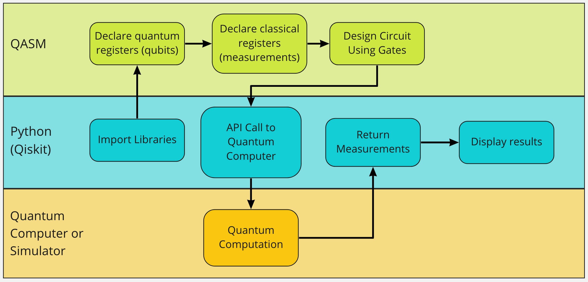
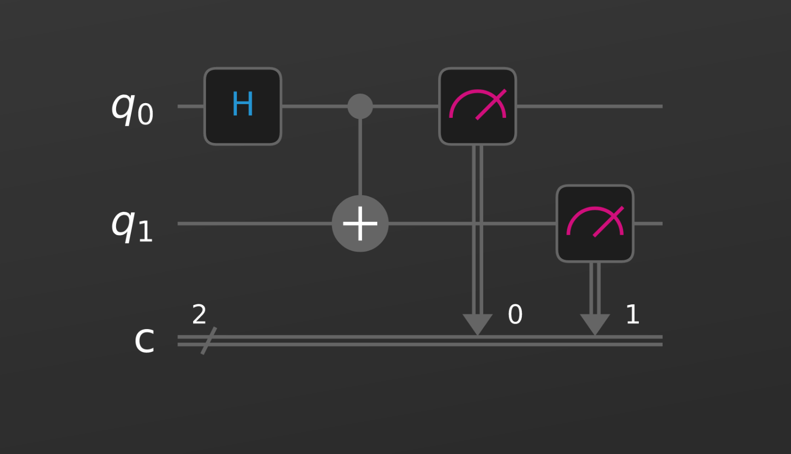

# Programming quantum computers

## Introduction

Quantum computing is here -- you can buy time on a quantum computer today. How can you know what to buy? What does a quantum computer do? How can it do something better than a classical computer? 

## Background

Here are all the things you should already know about quantum computers.


## Preliminary research findings or results

My claim is that these are cool things to know now about qc

## Charts or tables

## Preliminary conclusions

### Comparison of quantum to digital computing methods

Multiple measurements vs algorithms with deterministic outcomes. In the case of quantum computing often the same circuit will be evaluated thousands of times to build up a confidence in one measurement or a distribution of measurements. 

#### Languages
QASM is the basic assembly level intermediate representation for quantum code. It allows us to create two types of registries: quantum registries and classical registries. The quantum registries hold the information in qubits while the classical registries hold information in bits. Higher level languages use python libraries to represent the different parts of the quantum program.

Pure quantum computing: superposition and entanglement

Operations | Classical | Quantum
-----------|-----------|-------
Identity   |   yes     | yes
Negation   |   yes     | yes
Set 0      |   yes     | no
Set 1      |   yes     | no

Dealing with data -- very small number of classical bits: problems have to be broken into small pieces with quantum parts

Requirement for a hybrid approach. 

Classical computing types: char, int, float, string, dict, list.

Quantum data types are limited to qubits and the classical bits they are measured into

Fundamental qubit operations: rotations, reversible


Fundamental bit operations: identity, negation, set 0, set 1


### Quantum computing workflow visualization

We should understand quantum computation as a workflow between the classical computer and the quantum computer. In this example we will create a simple quantum program and follow its execution using standard open source tooling available for programming IBM quantum computers. At the highest level we can understand that the classical computer is used to define the computation we will do, then an API is used to communicate the quantum job to the chosen backend, in our case a simulator, though a similar method will be used to submit the job to actual quantum hardware.



```c
OPENQASM 2.0;
include "qelib1.inc";

// this is a basic quantum circuit that creates an entangled pair

qreg q[2];		// create a quantum register with 2 qubits
creg c[2]; 		// create a classical register with 2 bits
h q[0];  		// perform Hadamard gate on one qubit
cx q[0],q[1];  	// perform control-not gate on both qubits
// z q[1];
// an entangled state of the Bell-pair form has been created!
  
measure q[0] -> c[0];	//measure one qubit, and put outcome in one bit
measure q[1] -> c[1];	//measure the other qubit, and put outcome in the other bit
```
## Tentative plan for next step of the study

## Refs

